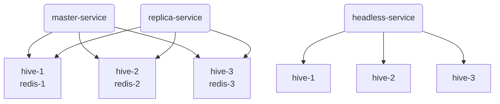
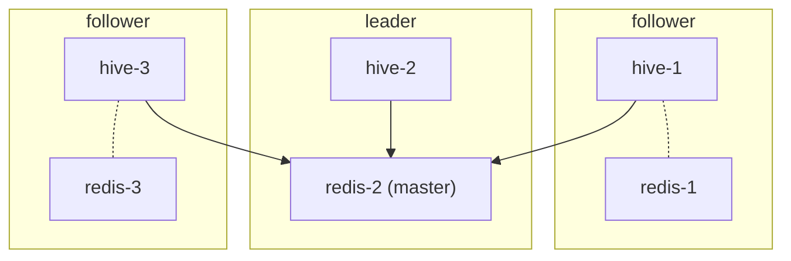

# redis-hive

Redis Hive is intended to fill a technical gap in the available offerings for Kubernetes deployments.

The goals of Redis Hive are to
* Elect a leader/master without maintaining a quorum
* Allow redis clients to perform writes without the need to look up the master
* Maintain a dataset without persistence
* Work in Kubernetes without requiring any Kubernetes API calls or RBAC privileges

## Motivation

The typical helm deployment of redis requires persistence to prevent data loss.

#### Master/Replica
One pattern is for the redis master and replicas are separate statefulsets with separate service names.

The replicas exist only to spread the load for reads. A lost master may incur brief downtime for writes, but the use of a PVC will allow the restarted master to continue with the dataset. This pattern works, so long as using PVCs is possible in your Kubernetes environment. Without persistence, the restarted master will overwrite all the replicas with empty data.

#### Sentinel
Another pattern is the use of redis-sentinel.

While a sentinel cluster is an effective way to elect a new master in general, there
are a few issues when deployed in Kubernetes. Namely, the sentinel cluster must retain its quorum when the redis master goes down
in order to elect a new master; that same quorum must remain intact when the lost master is restarted so it can become a replica
under the new. However, the fact that the sentinels are run in a sidecar container means that a pod restart will result in the loss
of a redis node and a sentinel at the same time. This can cause the sentinel cluster to lose its own membership, and a redis cluster
with two masters or no masters. This means the only safe way to restart or upgrade redis is to administratively scale the statefulset
down to one first. A lost Kubernetes node can split the cluster.

## Approach

To avoid the need to a quorum, Redis Hive requires a well-known means of determining hive candidates. In Kubernetes, this is a
DNS lookup on a headless service. Any hive instance that starts up in a new pod will be able to discover the current hive
membership and quickly identify the leader. During an election phase, the candidates exchange their timestamps of the start of
the election. The first candidate to initiate the election will win, with the alphabetically first IP address serving as the
tiebreaker. Generally, we expect the nodes in a Kubernetes cluster to have their system clocks synced, but this is not strictly
necessary.

To avoid the need for a client to be aware of the master, each Redis Hive instance will proxy all redis traffic to the current
master. Each redis instance is part of the same Kubernetes service for read-only traffic, and each hive instance is part of
a separate Kubernetes service for writes.

To maintain the dataset, each Redis Hive instance will keep its local redis replicating the master. When either a hive leader or
a redis master is lost, the remaining hive members will elect a new leader/master quickly and update the replication. A redis
master that crashes and restarts will defer and become a replica of the new master even if the election has not started yet. This
prevents the new empty dataset from overwriting the current replicated dataset.

The only Kubernetes types required are ClusterIP Services and Deployments. By querying a headless service, we avoid the need
to discover hive instances via API calls. By proxying traffic, we avoid the need to modify the redis master service. By keeping
the replicated data alive and electing replicas as master, we avoid the need to create PVCs. Taken together, these design choices
allow the deployment of an HA redis database within Kubernetes with minimal RBAC requirements.
